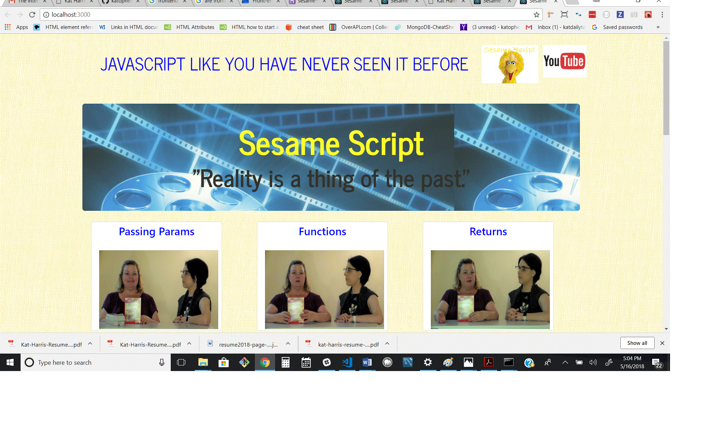

## Sesame Script 

## is a website that explains various Javascript functions, loops and terms. To help students understand Javascript, I decided to make a visual representation of some Javascript actions and terms. Coming from a background in Film and Theater I decided to act out  these functions. So I have filmed a visual representation of them. Visitors to the website can see the code, the definition and the "movie" of the function, as well as ask questions, make comments and request other things we could film.

Link to site 
https://sesame-script.herokuapp.com/

## Overview
This is a web application created using React. Click and image to see the video.

### Utilis
* React
* Bootstrap
* Reactstrap
* CSS
* HTML

